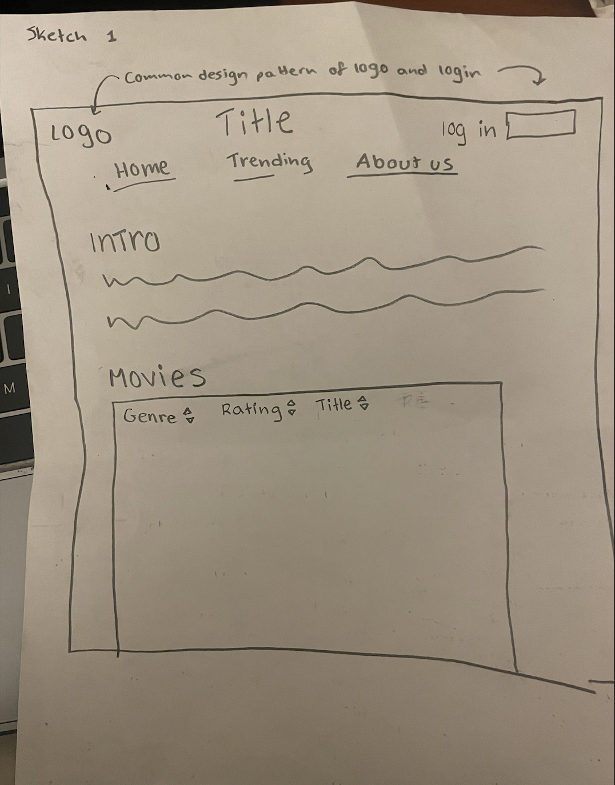
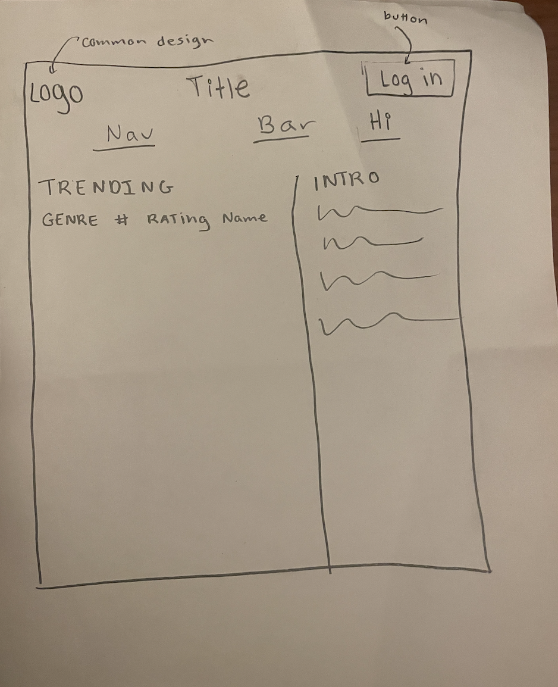
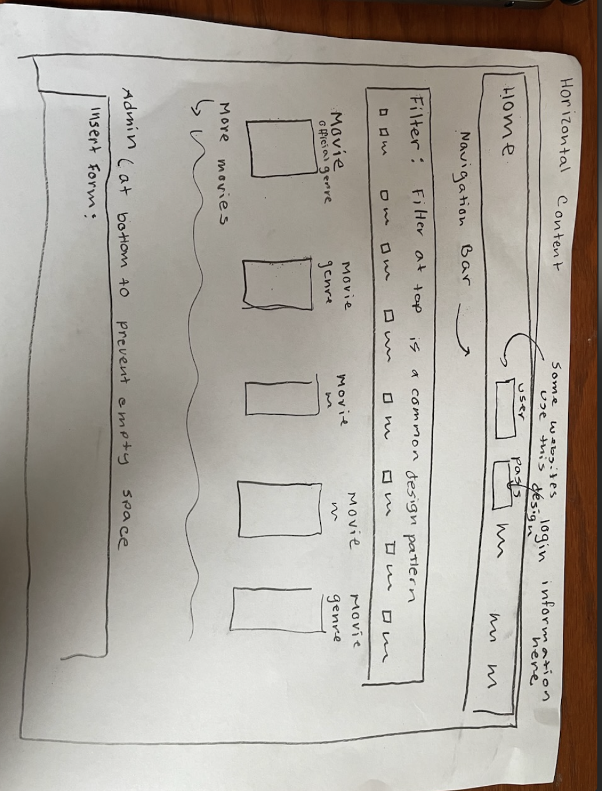
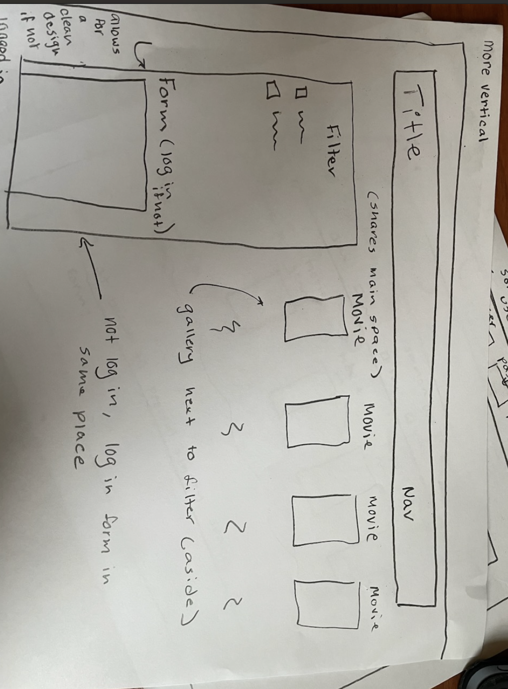

# Project 3: Design Journey

**For each milestone, complete only the sections that are labeled with that milestone.** Refine all sections before the final submission.

You are graded on your design process. If you later need to update your plan, **do not delete the original plan, rather leave it in place and append your new plan _below_ the original.** Then explain why you are changing your plan. Any time you update your plan, you're documenting your design process!

**Replace ALL _TODOs_ with your work.** (There should be no TODOs in the final submission.)

Be clear and concise in your writing. Bullets points are encouraged.

**Everything, including images, must be visible in _Markdown: Open Preview_.** If it's not visible in the Markdown preview, then we can't grade it. We also can't give you partial credit either. **Please make sure your design journey should is easy to read for the grader;** in Markdown preview the question _and_ answer should have a blank line between them.


## Design Plan (Milestone 1)

**Make the case for your decisions using concepts from class, as well as other design principles, theories, examples, and cases from outside of class (includes the design prerequisite for this course).**

You can use bullet points and lists, or full paragraphs, or a combo, whichever is appropriate. The writing should be solid draft quality.


### Catalog (Milestone 1)
> What will your catalog website be about? (1 sentence)

I think I'm going to make a catalog to review movies, it could be a combination of  movies and movie submissions. The media aspect will be the movie cover which provides a visual aspect to the recommendations and also a downloadable cover.


### _Consumer_ Audience (Milestone 1)
> Briefly explain your site's _consumer_ audience. Your audience should be specific, but not arbitrarily specific. (1 sentence)
> Justify why this audience is a **cohesive** group. (1-2 sentences)

The site audeince would most likely continue to be cinephiles or individuals that would like to get into the film community.

This is a cohesive audience as a common factor of this website would be expressed interest within movies so targeting the audience as individuals who already enjoy and desire to partake within this group would be a cohesive group.

### _Consumer_ Audience Goals (Milestone 1)
> Document your _consumer_ audience's goals for using this catalog website.
> List each goal below. There is no specific number of goals required for this, but you need enough to do the job (Hint: It's more than 1. But probably not more than 3.)
> **Hint:** Users will be able to view all entries in the catalog and insert new entries into the catalog. The audience's goals should probably relate to these activities.

Goal 1: Review Movies

- **Design Ideas and Choices** _How will you meet those goals in your design?_
  -- insert movie reviews
  - give it a star rating for each review


  - - potentially average out the ratings to get the actual rating.
- **Rationale & Additional Notes** _Justify your decisions; additional notes._
  -This would be an ideal goal for the site as it would allow users to give their input in regards to the film and be able to see actual data and average in regard to the film.

Goal 2: Add movies for consideration.

- **Design Ideas and Choices** _How will you meet those goals in your design?_
  - Insert Movie form
- **Rationale & Additional Notes** _Justify your decisions; additional notes._
  - By inserting the movie into a different page or a seperate are of the page, indivdiuals would be able to add reviews for movies outside the original scope.

Goal 3: Movie Catalog

- **Design Ideas and Choices** _How will you meet those goals in your design?_
  -- provide a gallery aspect to the movie catalog so that viewers will be able to see the movie cover and the current catalog list.

  - be able to filter the catalog by critic aspects which go more in depth then general genres because of their ability to fit multiple onto one movie.


### _Consumer_ Audience Device (Milestone 1)
> How will your _consumer_ audience access this website? From a narrow (phone) or wide (laptop) device?
> Justify your decision. (1 sentence)

Desktop
Most individuals wanting to communicate on a large online database would most likely use a desktop.


### _Consumer_ Persona (Milestone 1)
> Use the goals you identified above to develop a persona of your site's _consumer_ audience.
> Your persona must have a name and a face. The face can be a photo of a face or a drawing, etc.


<!-- Permission was granted to share Jake's image all infoirmation given below is not a reflection of jake in actuality and is solely given for the purpose of the assignment-->

Jake

**Factors that Influence Behavior:**

Jake is a cinephile, participating in IMDb and Letterboxd communities and is interested in providing discourse and recommendations for films.

**Goals:**

- be able to share and communicate with a community with an expressed interest in films.
- provide reviews and recommendations based on his personal interests.

**Obstacles:**

- over saturation of film platrforms, doesn't know where to go

**Desires:**
- small community of individuals interested in fiolm that can provide recommendations and reviews.


### _Administrator_ Audience (Milestone 1)
> Briefly explain your site's _administrator_ audience. Your audience should be specific, but not arbitrarily specific. (1 sentence)
> Justify why this audience is a **cohesive** group. (1-2 sentences)

Individuals with ecperience within film and that can add movies and provide more accurate ratings to the site.

Shows a cohesive group of individuals with a united goal to spread their interest in film reviews without overfilling the data.

By only allowing administrators to formally rate the movies it dimishes the amount of individual bias rather individual ratings are viewed in the movie reviews page.

These administrators by being individuals withj formal knowledge of movies rather than any member of the community will be able to accurqately upodate the catalog, knowing what kind of uimages to add so that the upload is safer from inkection, and will be better able to tag the movies in the catalog due to their experience within the subject.


### _Administrator_ Audience Goals (Milestone 1)
> Document your _administrator_ audience's goals for using this catalog website.
> List each goal below. There is no specific number of goals required for this, but you need enough to do the job (Hint: It's more than 1. But probably not more than 3.)
> **Hint:** Users will be able to view all entries in the catalog and insert new entries into the catalog. The audience's goals should probably relate to these activities.

Add new films to dataset

- **Design Ideas and Choices** _How will you meet those goals in your design?_
  - administrators are able to directly access the catalog database and are able to insert new movies that fulfill the general audiences goals. They are able to add and unadd movies into the catalog they are also able to tag movies more accurately because of theyre position as film critics and administrators.
  -
- **Rationale & Additional Notes** _Justify your decisions; additional notes._
  - Allows for more personal and secure additions to the catalog. Since administrators are knowledgeable they are also able to tag more accurately.

Delete entries

- **Design Ideas and Choices** _How will you meet those goals in your design?_
  -be able to delete old movies or movies that have grown out of liking.
- **Rationale & Additional Notes** _Justify your decisions; additional notes._
  - we all get tired of movies and if a movie falls in popularity administrators should be able to access the site to remove out of date movies and films. this would diminish the cluttering and overclustering of the catalog.

Delete reviews

- **Design Ideas and Choices** _How will you meet those goals in your design?_
  - they will be able to delete innapropriate or rude entries in the reviews catalog
- **Rationale & Additional Notes** _Justify your decisions; additional notes._
  - since general members can be anyone interested in the cinema community they may be able to add reviews that go against the page guidelines so by having administrators be able to delete reviews it will help in keeping the community safe.


### _Administrator_ Persona (Milestone 1)
> Use the goals you identified above to develop a persona of your site's _administrator_ audience.
> Your persona must have a name and a face. The face can be a photo of a face or a drawing, etc.


<!-- Image of raquel was used with her permission and any information given may not be an accurate representation of her-->

raquel has a bachelors degree in film and she is interested in reviewing whats trending and getting accurate reviews

**Factors that Influence Behavior:**

Raquel has a bachelors degree in film and she is interested in reviewing whats trending and getting accurate reviews. She currently is a highranking member of letterboxd and is working in film production.

**Goals:**

- get accurate representations of audience taste within small samples.
- partake in film communities with accurate and realistic conversations.
**Obstacles:**

bots, spam, and too much information

**Desires:**

- small platform for trending reviews and movies
- take a leadership role within the film community.


### Catalog Data (Milestone 1)
> Using your personas, identify the data you need to include in the catalog for your site's audiences.
> Justify why this data aligns with your persona's goals. (1 sentence)

trending movies, reviews, and ratings, and cover images

be able to see what currently is trending for her job and produce better cinema.


### Site Design (Milestone 1)
> Design your catalog website to address the goals of your personas.
> Sketch your site's design:
>
> - These are **design** sketches, not _planning_ sketches.
> - Use text in the sketches to help us understand your design.
> - Where the content of the text is unimportant, you may use squiggly lines for text.
> - **Do not label HTML elements or annotate CSS classes.** This is not a planning sketch.
>
> Provide a brief explanation _underneath_ each sketch. (1 sentence)
> **Refer to your persona by name in each explanation.**


- this image provides the intro and short about us before the content so that it is the primary content the audience sees and sghares the sites intended goal.


Places the intro to the aside, howeer may look a little odd when imp;emented.

Revised:

Design Ideas and Reasoning:
This design is more horizontal in the sense that things are laid out more horizontally such as the nav bar and login being condensed into one box and the filtering box being at the top of the gallery. The filtering box at the top of the gallery is a common design principle for many stores and it allows for the user to firstly look and be able to filter data before looking at the gallery.
The administrator insert form at the bottom would prevent empty sppace on the side and would make it seem like theres nothing else. In implementing this for the reviews page it would allow for easier data filtration, however one downside is that in the reviews page the insert review form might get lost at the bottom with too much content.


Tgis design implements a more code and function forward design by having the log in and form be interchangabvle when tghe user is not signed in and when the user is signed in. By implementing a more vertical tecnique that is to say that the gallery and filters share the main space by implementing screen sharing it could possibly prevent the form from being lost if theres too much data which is a better design tactic. One downside is that it goes directly into the content however i could brush this up by adding a box before the main that introduces the content. This is a more intricate design.


### Catalog Design Patterns (Milestone 1)
> Explain how you used design patterns in your site's design. (1-2 sentences)

Design patterns influenced my design by influencing where i put the title and log in form along with the nav bar and title placement. I also utilized design aspects to discern where to place the intro. I utilixed my prior cs knowledge to learn more about functions and content placing.


## Implementation Plan (Milestone 1, Milestone 2, Milestone 3, Final Submission)

### Database Schema (Milestone 1)
> Plan the structure of your database. You may use words or a picture.
> A bulleted list is probably the simplest way to do this.
> Make sure you include constraints for each field.


<--Gallery Information-- >

(this is going to be the general movie table)
Table: movies
- field1: id int {NN, AI, U, PK...},
- genre int {NN}
- Name text {U, NN}
- Rating int {NN}
- review{FK}

Table: Reviews (link the movies table to the reviews table so that there can be multiple reviews to a single movie linked by a foreign key)
  field1: id int {NN, AI, U, PK...},
- text text {NN}
- Rating int {NN}
- movie_id{FK} from Movies

Table tags: links tags to movie through movie_id allows movie to have multiople tags

field1: id int {NN, AI, U, PK...},
- movie_id int {FK NN}
- tag text {NN}

CREATE TABLE images
this links the movie table to the images table and allows for storing the movies origional data before modifying it to the database links the images table to movies with the movie_id foreign key  (
  id INTEGER NOT NULL UNIQUE,
  movie_id INTEGER NOT NULL,
  file_name TEXT NOT NULL,
  file_ext TEXT NOT NULL,
  source TEXT,
  PRIMARY KEY(id AUTOINCREMENT),
  FOREIGN KEY(movie_id) REFERENCES movies(id)
);


<-- User Information -->
INSERT INTO
  users (id, name, email, username, password)
VALUES
  (
    1,
    'Ignacio Estrada',
    'ire2s@cornell.edu',
    'iggy',
    '$2y$10$QtCybkpkzh7x5VN11APHned4J8fu78.eFXlyAMmahuAaNcbwZ7FH.' -- monkey
  );

CREATE TABLE groups (
  id INTEGER NOT NULL UNIQUE,
  name TEXT NOT NULL UNIQUE,
  PRIMARY KEY(id AUTOINCREMENT)
);

INSERT INTO
  groups (id, name)
VALUES
  (1, 'admin');

--- Group Membership ---
CREATE TABLE user_groups (
  id INTEGER NOT NULL UNIQUE,
  user_id INTEGER NOT NULL,
  group_id INTEGER NOT NULL,
  PRIMARY KEY(id AUTOINCREMENT) FOREIGN KEY(group_id) REFERENCES groups(id),
  FOREIGN KEY(user_id) REFERENCES users(id)
);

-- User 'kyle' is a member of the 'admin' group.
INSERT INTO
  user_groups (user_id, group_id)
VALUES
  (1, 1);

### Database Query Plan (Milestone 1, Milestone 2, Milestone 3, Final Submission)
> Plan _all_ of your database queries.
> You may use natural language, pseudocode, or SQL.

```
for my first page the gallery i need to be able to link movies and images so
SELECT (movie data which includes name genre, etc.) from movies and ill need to join it with my images table through the movie id so LEFT JOIN images WhERE (movies.id = images.movie_id)

The query above will also be my main string for queries in the gallery ads the images and movie data inquired doesnt change

i will need to add tags so i will need to add a string to the above sql to join tags where tag = tag and tags.movie_id = movie.id


```
for my reviews table i will need to join my movies table to my reviews so

SELECT (movie content ) FROM movies INNE JOIN reviews where movies.id = reviews.movie_id
```
I am also using a data query to sort my tags so
SELECT tags FRom tag


I also need the movie.id for movie names to insert a review so

SELECT id from MOvies

I will insert into movies  images, reviews so

insert into movies (name, genre, rating)
INsert into images( file name, file ext, source, movie id)

Insert into reviews( text, rating, movie_id)


## Complete & Polished Website (Final Submission)

### Accessibility Audit (Final Submission)
> Tell us what issues you discovered during your accessibility audit.
> What do you do to improve the accessibility of your site?

There were three contrast errors with my WAVE audit which i fixed, the red was too dark for my feedback wioth a dark background so i changed it to a white-pink so that it still had the redish hue of an error and was discernable.


### Self-Reflection (Final Submission)
> Reflect on what you learned during this assignment. How have you improved from Projects 1 and 2?

This project was something I am very proud of I wanted to make a piece that was extremely code intricate and be able to add it to my portfolio. If i had more planning time I would've added tag inserts and deletion and I think i will in my personal time as i found this project very fun and challenging.


> Take some time here to reflect on how much you've learned since you started this class. It's often easy to ignore our own progress. Take a moment and think about your accomplishments in this class. Hopefully you'll recognize that you've accomplished a lot and that you should be very proud of those accomplishments! (1-3 sentences)

I've learned so much esopecially tying in together my other coding experience with this course. Im very proud of my new abilities and very much enjoy web design.


### Collaborators (Final Submission)
> List any persons you collaborated with on this project.

N/A


### Reference Resources (Final Submission)
> Please cite any external resources you referenced in the creation of your project.
> (i.e. W3Schools, StackOverflow, Mozilla, etc.)

Mozzila


### Grading: User Accounts (Final Submission)
> The graders will need to log in to your website.
> Please provide the usernames and passwords.

**Administrator User:**

- Username: kyle
- Password: monkey

**Consumer User:**

- Username: iggy
- Password: monkey

**Note:** Not all websites will support consumer log in. If your website doesn't, say so.


### Grading: Step-by-Step Instructions (Final Submission)
> Write step-by-step instructions for the graders.
> The project if very hard to grade if we don't understand how your site works.
> For example, you must log in before you can delete.
> For each set of instructions, assume the grader is starting from /

_View all entries:_

1. view all is under the filter side or you can deseelect all the filters for the gallery and resubmit.
2. for the filter on the reviews theres view all options.

_View all entries for a tag:_

1. view all is under the filter side or you can deseelect all the filters for the gallery and resubmit.
2.

_View a single entry's details:_

1. Click on the movie name/ title on the gallery
2.

_How to insert and upload a new entry:_

1. For reviews use consumer and log in and go to reviews page
2. For movie catalog use admin and look on the left hand side

_How to delete an entry:_

1. Not Required for project
